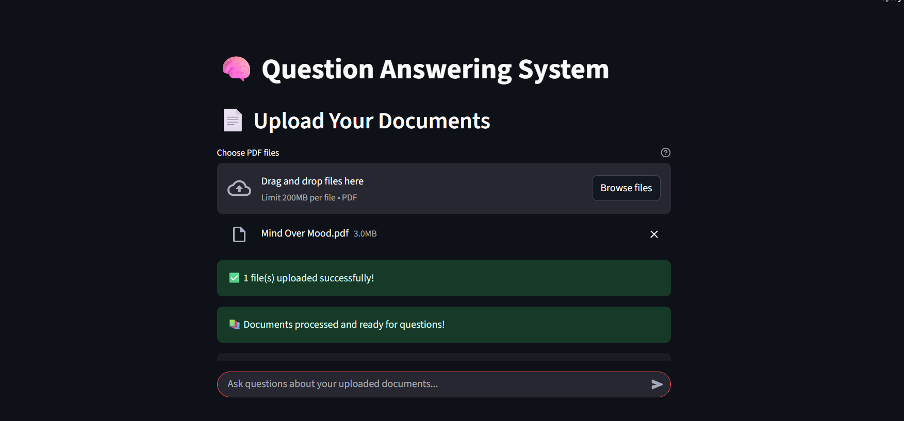

# 📚 AI-Powered PDF Question Answering System

This project is a locally hosted **question answering system** that allows users to upload one or more PDF documents and ask natural language questions. It uses a combination of document chunking, semantic search, and a local LLM (LLaMA 3.1–8B) to provide accurate and context-specific answers — all without needing an internet connection.

---

## 🔍 Features

- 📄 Upload one or multiple PDFs
- 💬 Ask questions in plain English based on uploaded documents
- 🧠 Powered by **LLaMA 3.1 – 8B**, running locally via Ollama
- 🔎 Fast semantic search using **FAISS vector store**
- 📌 Answers are context-aware and grounded in document content
- 🛡️ Entirely offline — 100% local processing

---

## 🧰 Tech Stack

| Component            | Tool / Library                                 |
|---------------------|------------------------------------------------|
| LLM Backend          | `llama3:8b` via Ollama                         |
| Document Upload      | Streamlit's `file_uploader`                    |
| Document Loading     | `PyPDFLoader`, `DirectoryLoader` (LangChain)   |
| Text Chunking        | `RecursiveCharacterTextSplitter`              |
| Embedding Model      | `all-MiniLM-L6-v2` (HuggingFace)              |
| Vector Store         | FAISS                                          |
| Retrieval Logic      | LangChain’s `RetrievalQA`                     |
| Chat Interface       | Streamlit                                     |

## 📸 Screenshot

